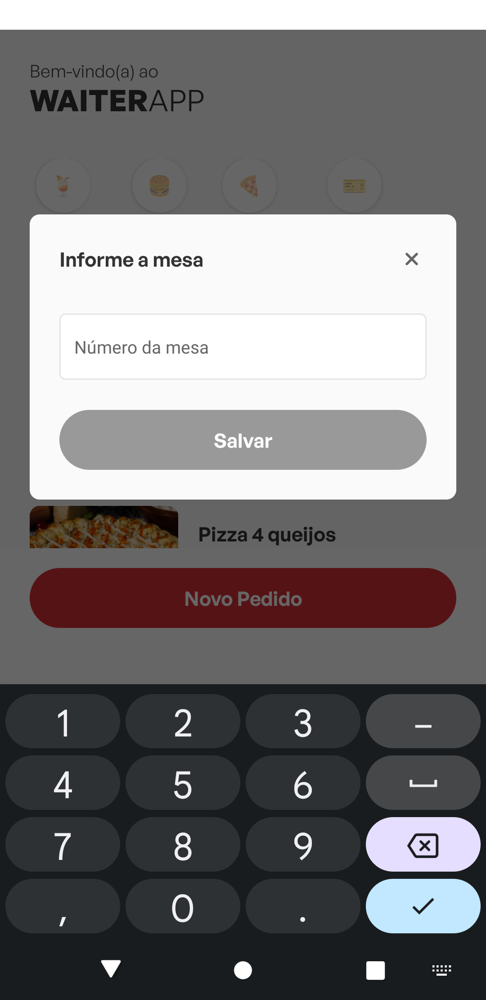
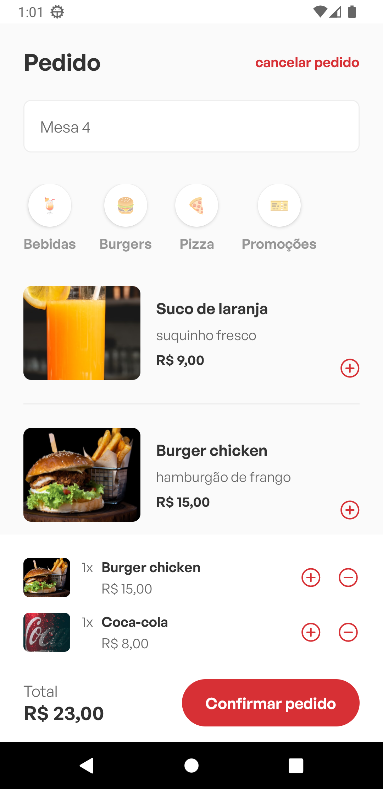
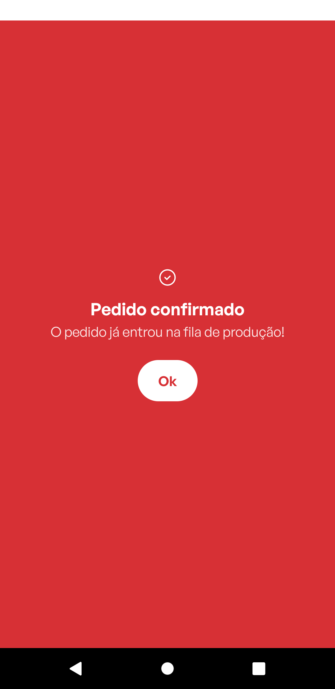
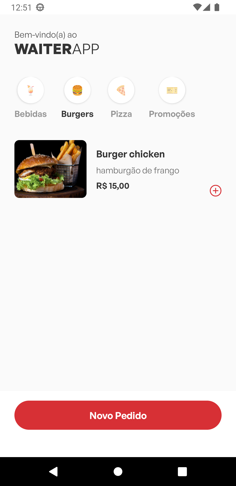
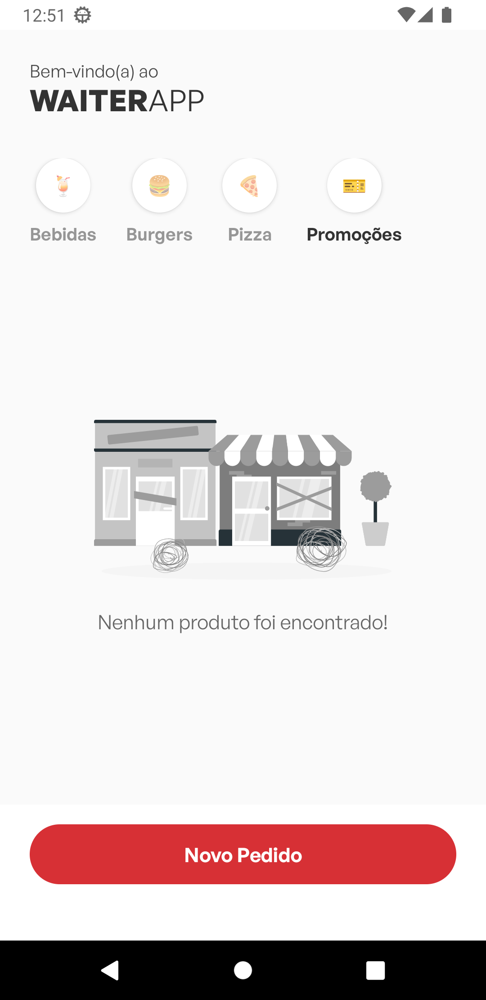

# WaiterApp

  

> Aplicação desenvolvida em React Native voltada para restaurantes e lanchonetes. Os clientes têm a possibilidade de explorar com facilidade os variados cardápios oferecidos por cada estabelecimento. Além disso, o aplicativo proporciona uma experiência de pedido simplificada e prática, permitindo que os clientes façam seus pedidos de forma intuitiva e sem complicações.

## 💻 Tecnologias utilizadas

### Ferramentas usadas durante o desenvolvimento da aplicação:

-   [React Native](https://reactnative.dev/)
-   [Typescript](https://www.typescriptlang.org/)
-   [Axios](https://axios-http.com/ptbr/docs/intro)
-   [styled-components](https://styled-components.com/)
-   [Eslint](https://eslint.org/)
-   [Expo](https://expo.dev/)
-   [Yarn](https://yarnpkg.com/)

## 📲 Funcionalidades

### Principais funcionalidades presentes na aplicação:

-   Listagem dos produtos disponíveis no cardápio;
-   Possibilidade de filtragem dos produtos por categoria;
-   Realizar pedido;
-   Opção de cancelar pedido.

## 🎨 Telas da aplicação

### A seguir, alguns prints da UI da aplicação:

 

##
